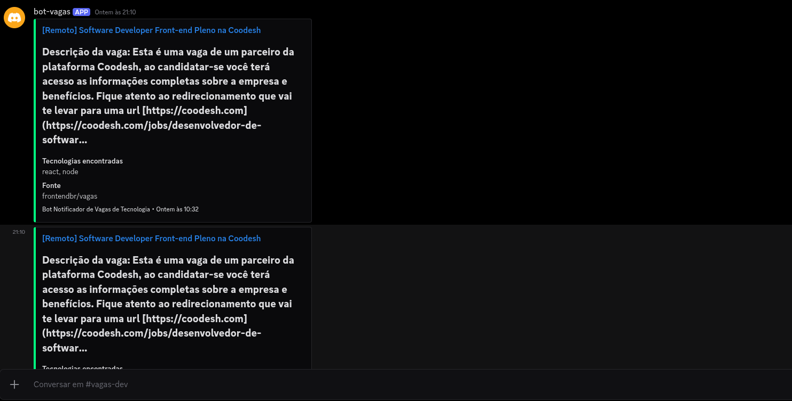

# Bot de Vagas para Discord

Bot feito com [NestJS](https://nestjs.com/) e [Necord](https://necord.org/) (discord.js). Ele busca vagas de tecnologia publicadas como issues no GitHub e as envia para um canal do Discord.



## Funcionalidades

- Consulta as issues abertas mais recentes destes repositórios:
  - [frontendbr/vagas](https://github.com/frontendbr/vagas)
  - [backend-br/vagas](https://github.com/backend-br/vagas)
  - [react-brasil/vagas](https://github.com/react-brasil/vagas)
- Filtra as vagas pelas tecnologias citadas no título ou na descrição: React, Node.js, Angular, Express e NestJS.
- Publica cada vaga como embed com título, link, resumo da descrição, tecnologias encontradas e repositório de origem.
- Antes de publicar, confere as últimas 100 mensagens do canal para não repetir vagas.
- Faz uma busca ao iniciar e depois repete a cada hora.
- Confere se o bot tem acesso e as permissões necessárias no canal e mostra mensagens de erro claras quando algo falta.

## Pré-requisitos

- Node.js `>= 20.19.0`
- Uma aplicação/bot criada no [Discord Developer Portal](https://discord.com/developers/applications)
- O bot adicionado ao servidor com estas permissões no canal de vagas:
  - View Channel
  - Read Message History
  - Send Messages
  - Embed Links

## Configuração

1. Clone o repositório e instale as dependências:

   ```bash
   git clone git@github.com:viniciussoaresbr/bot-vagas-discord.git
   cd bot-vagas-discord
   npm install
   ```

2. Crie um arquivo `.env` na raiz do projeto:

   ```env
   DISCORD_TOKEN=seu-token-do-bot
   DISCORD_JOBS_CHANNEL_ID=id-do-canal-de-vagas
   ```

   | Variável                  | Descrição                                                                                     |
   | ------------------------- | --------------------------------------------------------------------------------------------- |
   | `DISCORD_TOKEN`           | Token do bot (Developer Portal → Bot → Reset Token).                                          |
   | `DISCORD_JOBS_CHANNEL_ID` | ID do canal onde as vagas serão publicadas (ative o Modo Desenvolvedor e use "Copiar ID do canal"). |

   > O `.env` já está no `.gitignore`. Nunca faça commit do token.

## Execução

```bash
# desenvolvimento (recarrega ao salvar)
npm run start:dev

# produção
npm run build
npm run start:prod
```

## Scripts

| Script               | Descrição                                   |
| -------------------- | ------------------------------------------- |
| `npm run build`      | Compila o projeto para `dist/`.             |
| `npm start`          | Inicia o bot com o Nest CLI.                |
| `npm run start:dev`  | Inicia em modo watch.                       |
| `npm run start:prod` | Executa a versão compilada (`dist/main.js`). |
| `npm run typecheck`  | Verifica os tipos sem gerar arquivos.       |

## Estrutura

```
src/
├── main.ts           # bootstrap da aplicação
├── app.module.ts     # módulos: Config, Necord (Discord), Schedule e Http
└── jobs.service.ts   # busca, filtro e publicação das vagas
```

## Personalização

Os repositórios consultados e as tecnologias filtradas ficam nas constantes `GITHUB_REPOSITORIES` e `TECHNOLOGY_KEYWORDS`, em `src/jobs.service.ts`. Para mudar a frequência da busca, altere a expressão do `@Cron` no mesmo arquivo.
